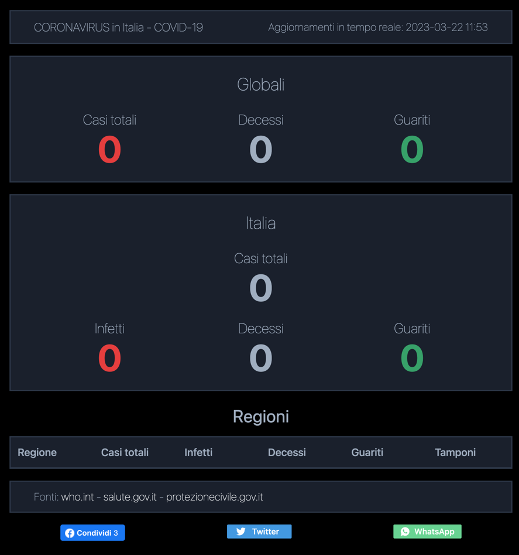

🔬 Coronavirus WebUI in Angular
===============================

This is a web application developed with Angular that displays the latest statistics on the coronavirus epidemic in Italy and around the world. The app uses a Firebase database to retrieve and display the data.

🚀 Getting Started
------------------

To run the application, you need to have Node.js and Angular CLI installed on your system. Follow the instructions below to install them:

1.  Install Node.js from the [official website](https://nodejs.org/).
2.  Install Angular CLI by running the following command in the terminal: `npm install -g @angular/cli`

Once Node.js and Angular CLI are installed, follow the steps below to run the application:

1.  Clone the repository to your local machine.
2.  Navigate to the project folder in the terminal.
3.  Run `npm install` to install all dependencies.
4.  Create a Firebase project and database by following the instructions in the Firebase documentation.
5.  Replace the Firebase configuration values in the `src/environments/environment.ts` file with your own Firebase configuration values.
6.  Run `ng serve` to start the development server.
7.  Navigate to `http://localhost:4200` in your web browser to view the application.

💻 Usage
--------

When you open the application, you will see the latest statistics on the coronavirus epidemic in Italy and around the world. The data is displayed on a single page, with the global and Italy totals at the top and the detailed table of regions at the bottom.

The global and Italy totals display the following statistics:

-   Total cases
-   Total deaths
-   Total recoveries

Click on a row in the region table to view detailed statistics for that region. The region table displays the following statistics for each region:

-   Total cases
-   Active cases
-   Total deaths
-   Total recoveries
-   Total tests

The data is retrieved from the Firebase database and updated every few minutes to ensure that the statistics are accurate.

🙌 Contributions
----------------

Contributions to this project are welcome. If you find a bug or have a feature request, open an issue on the GitHub repository. If you want to contribute to the code, fork the repository and create a pull request.

## Final Result

